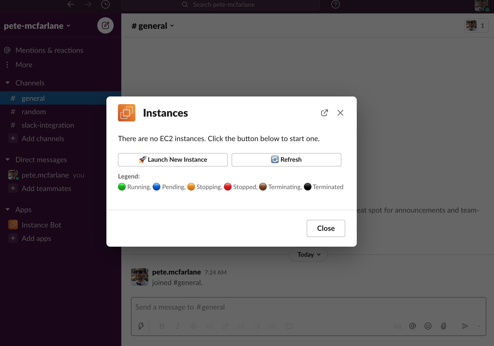

# EC2 Instance Manager for Slack

I was challenged to create a Slack bot to manage cloud instances (see CHALLENGE.md). I chose AWS as the cloud provider as I have most familiarity with this platform.

[Watch demo video here ](https://www.loom.com/share/a04754161a2b426bbb9bcb14865d186c)

First step: Create a new AWS account.
### Managing instances

I decided to use the Serverless framework, with TypeScript, and hosted on my new AWS account using API Gateway and Lambda, because I believed this would be an ideal solution for a Slack bot - we don't have to provision a server to be continually running, we can just respond on demand.

My initial approach was to create 6 functions (to create, stop, start, remove, list and get status of an EC2 instance). I started from a [Serverless with Typescript skeleton project](https://github.com/serverless/serverless/tree/master/lib/plugins/create/templates/aws-nodejs-typescript). For speed, I created a `serverless-deployment` user with an IAM policy in the AWS console - this could have been created using CloudFormation or another Infrastructure-as-Code service.

I used the `aws-sdk` for NodeJS to communicate to my AWS account. I had to grant specific permissions to the Lambda function role (e.g. `ec2:DescribeInstances`, `ec2:StartInstances` etc.) as I started adding more functionality.

Using TypeScript was really helpful to determine the shape of the requests/responses coming from the AWS API.

### Slack bot
Once I had the functionality working, I wanted to try setting up the Slack bot. I chose the Slack [Bolt-js Framework](https://slack.dev/bolt-js/reference) to help me. The have an option for running as a Lambda service, rather than a HTTP server, although there were a few issues with the TypeScript definitions. (For example, the `app.start()` near the bottom of `src/functions/slack/events/handler.ts` isn't generic so I had to do some typescript ugliness to get it to compile:
```typescript
// todo the library docs note that the start() should be made generic, see if I can get around to making a PR for this...
const handler: AwsHandler | any = await app.start();
```

I then tried to add a Slack shortcut - I thought this would be quite a nice way to interact with the app. The shortcut can be accessed from any channel by hitting the `/` button or clicking the ⚡️ button on the left, or the global search bar `⌘` + `G` and searching "list instances".

### Accessing the instance manger


### No instances running, yet


### Some running and terminated instances


There is a listener inside `src/functions/slack/events/handler.ts` which responds to this by calling the library command `listInstances()` and with that response, renders a Slack Block-based view of any/each EC2 instances, with a colourful icon to represent the instance status, and the instance name.
The [Slack block kit](https://api.slack.com/block-kit) has a playground which makes it really nice to create interactive modals and views. Part of this is a section with a selection, where you can have a dropdown with different actions. I decided to use this, rather than having separate slack commands, to interact with the instances. I know this deviates from the brief slightly, but I think it matches the Slack, interactive experience - I hope this is understandable!

Each action in the mutli-select is handled by another listener in `src/functions/slack/events/handler.ts`. We parse the action payload, which contains the action and the instance id, then send the request to the ec2 library.
### EC2 instance states
I decided on a simple, colour coded status to display each instance state (some of these match the colours chosen by AWS too in their UI) 🟢 Running, 🔵 Pending, 🟠 Stopping, 🔴 Stopped, 🟤 Terminating, ⚫️ Terminated. I put a small legend at the bottom of the modal to help users understand what each state means.

Based on the state of the instance, e.g. if an instance is running, I can either `terminate` or `stop` it, so these are the only actions visible. If an instance is currently stopped, I can either `start` or `terminate` it etc.

### Timing issues

After the ec2 command to start/stop/terminate an instance, I wanted to update the view. This can be done with the bolt-js framework, but responses have to be delivered within 3 seconds of the request. From my experience, calling `listInstances()` immediately after calling `terminateInstance()` or `stopInstance()` sometimes was too quick to show the new instance state. I experimented adding a sleep function between the action and listing, but this just left the application feeling a bit laggy, and worse it sometimes pushed the response time over the 3 second window and the request failed.
In the end I compromised and added a "refresh" button to the modal, which can be manually pressed as and when. Given more time I would have liked to find a nicer, more asynchronous solution to this!

## Future iterations

The whole project was thrown together rather hastily. There was not a lot of thought put into failure scenarios so I'm sure it could be made much more resilient. For example, what error do we get if the role doesn't have correct permissions, or one of the EC2 functions fail? It would be nice to report a friendly error back to the user rather than just crash!

There are no unit or integration tests. I would more time to do research on the best way to do integration tests with Bolt JS. One approach would be to sample some incoming requests to the lambda service, then sample the response. We could store these gold-disk versions, and run them against the source code as part of the CI stage. We get some confidence from TypeScript that our types match if we pass the compiler. There's not a whole lot to unit test, except we could stub out the ec2 service and see what happens if one of our library promises is rejected.

Slack Interface: This could be updated to include all sorts of useful information - like last launched/stopped at, instance type, ami image, who launched it etc. I did try to add a Slack home page to the app but had issues with this and serverless/lambda and at the time it didn't seem like a high priority - the modal interface still works.

EC2 limitations: For now I've fixed the type of EC2 instance to a `t2.small` (as it's available on a free tier) and just set the base AMI in an environment variable. It could be nice to make these configurable in a real app.

There's also no function to limit the number of instances launched at the moment! This would be a major concern for me in a real app as the bills could quickly rack up!

## References

- https://betterprogramming.pub/set-up-your-serverless-project-with-typescript-ready-to-deploy-to-aws-6cfd7b2e5263
- https://medium.com/glasswall-engineering/how-to-create-a-slack-bot-using-aws-lambda-in-1-hour-1dbc1b6f021c
- https://api.slack.com/start/building/bolt-js
## Installation/deployment instructions

> **Requirements**: NodeJS `lts/fermium (v.14.15.0)`.

- Run `npm i` to install the project dependencies

### Project structure

The project code base is mainly located within the `src` folder. This folder is divided in:

- `functions` - containing code base and configuration for the lambda functions
- `libs` - containing shared code base between the lambdas

### 3rd party libraries

- [@serverless/typescript](https://github.com/serverless/typescript) - provides up-to-date TypeScript definitions for your `serverless.ts` service file
- @aws-sdk/client-ec2 - for communicating with EC2
- @slack/bolt - for handling Slack interactions
